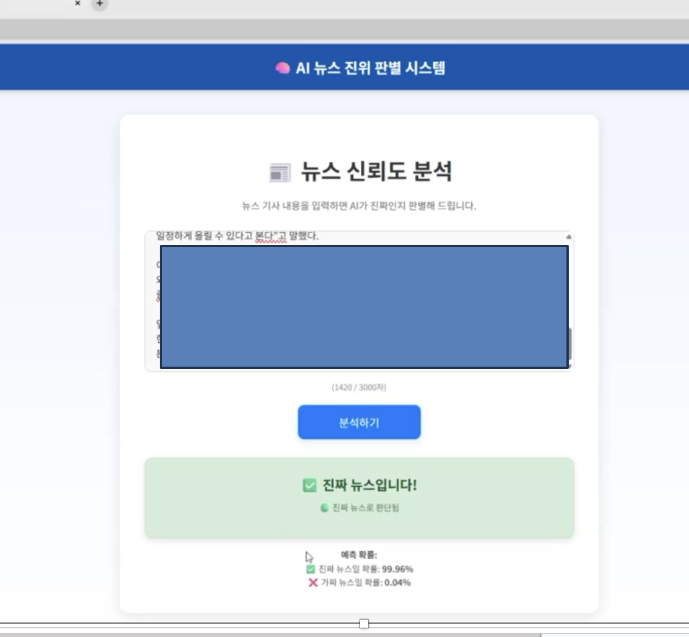

# KoELECTRA 기반 가짜 뉴스 탐지기 (Fake News Detector)

본 프로젝트는 KoELECTRA 모델을 기반으로 한 **한국어 뉴스 진위 판별 시스템**입니다.  
Optuna를 활용해 KoELECTRA 모델의 하이퍼파라미터를 자동 탐색하여 성능을 향상시켰습니다.

## 📌 프로젝트 개요

- **모델**: KoELECTRA (monologg/koelectra-base-discriminator)
- **방식**:
  - 문장 단위로 입력을 분할 (청크 처리)
  - 각 청크별 예측 결과를 가중 평균하여 기사 단위 판단
  - 키워드 기반 점수를 앙상블하여 정밀도 향상
- **예외 처리**:
  - 반복 문자 / 무의미한 입력 감지
  - 너무 짧거나 이상한 입력은 예측 차단

## 기술 스택

- Python 3.10 이상
- FastAPI (백엔드)
- React (프론트엔드)
- Hugging Face Transformers
- Scikit-learn, torch, etc.

---
## 🚀 실행 방법

###  1. 모델 다운로드

모델은 Hugging Face에서 직접 다운로드합니다.  
아래 링크에서 다운로드한 후 `model/` 디렉토리에 압축을 해제하세요.

모델 주소: [https://huggingface.co/olopy/fakenews_pridict](https://huggingface.co/olopy/fakenews_pridict)

### 2. 백엔드 실행 (FastAPI)
```bash
# 1. 가상환경 실행 (선택)
python -m venv venv
source venv/bin/activate   # macOS/Linux
venv\Scripts\activate      # Windows

# 2. 의존성 설치
pip install -r requirements.txt

# 3. 백엔드 실행
uvicorn app.main:app --reload

```

## 📸




